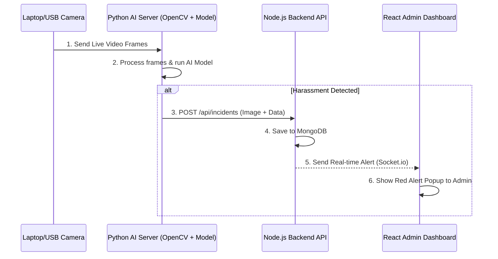

# Harassment Detection System - Complete Architecture & Flow

Taake aaj aap apne laptop camera se harassment detect karwa sakein, aapko ek **Python AI Module** banana hoga jo aapke maujooda Node.js aur React.js system ke sath connect hoga. 

Neeche poora step-by-step flow detail mein diya gaya hai.

---

## 1. System Architecture Flow

Yahan dekhein ke teeno components (React, Node.js, Python) aapas mein kaise baat karenge:



---

## 2. Step-by-Step Implementation Guide

Harassment detect karwane ke liye aapko in **4 major steps** par kaam karna hoga:

### Step 1: Python ka AI Environment Setup karna
Aapka AI model Python mein banega kyunke machine learning libraries Python mein best kaam karti hain.
1. Apne computer mein **Python** install karein.
2. Naya folder banayein (e.g. `ai_backend`) aur libraries install karein:
   ```bash
   pip install opencv-python mediapipe tensorflow numpy requests
   ```
   * `opencv-python`: Camera on karne aur video ko read karne ke liye.
   * `mediapipe` / `tensorflow`: Insani harkat (pose) aur harassment detect karne ke liye.
   * `requests`: Python se Node.js ko alert (API request) bhejne ke liye.

### Step 2: Camera on karna aur Video Read karna (Python)
Aapko ek Python script (`detector.py`) likhni hogi jo laptop ka camera on kare:
```python
import cv2

cap = cv2.VideoCapture(0) # 0 means Laptop Camera (1 for USB webcam)

while True:
    ret, frame = cap.read()
    
    # Yahan AI model frames ko check karega
    
    cv2.imshow('Live Camera', frame)
    if cv2.waitKey(1) & 0xFF == ord('q'):
        break

cap.release()
cv2.destroyAllWindows()
```

### Step 3: AI Model Integrate karna (The Brain)
Ye sab se important part hai. Camera jo video de raha hai, usko analyze karna hai ke aaya normal activity hai ya koi fighting/harassment.
Iske do tareeqay hain:
* **Asan Tareeqa (For Today):** Aap `MediaPipe Pose` use karein jo body ke points (haath, paon) detect karta hai. Agar do logon ke haath tezi se move ho rahe hain ya aapas mein takra rahe hain (distance kam ho gaya hai), to usay "Harassment" ya "Fight" declare kar dein.
* **Professional Tareeqa:** Aap kisi Action Recognition Model (jaise 3D-CNN ya SlowFast) ko fighting aur harassment ki videos par train karein aur us trained model `.h5` ya `.pt` file ko apni script mein load karein.

### Step 4: Backend API ko Alert Bhejna (Integration)
Jab Python ki `if` condition true ho (yani harassment detect ho jaye), to Python script us waqt ka ek screenshot legi aur aapke Node.js server ko bhej degi:

```python
import requests
import cv2

# ... AI detection logic ...
if harassment_detected:
    # 1. Screenshot save karein
    cv2.imwrite('incident.jpg', frame)
    
    # 2. Node.js backend ko API request bhejein
    url = 'http://localhost:5000/api/incidents'
    data = {
        'type': 'Physical Harassment',
        'cameraId': 'CAM-01',
        'location': 'Library',
        'status': 'New'
    }
    files = {'evidenceImage': open('incident.jpg', 'rb')}
    
    response = requests.post(url, data=data, files=files)
    print("Alert sent to server!")
```

### Step 5: Real-time Alert on React Dashboard
Jaise hi Node.js (Backend) ke paas Python ki taraf se POST request aayegi:
1. Node.js us incident ko MongoDB mein save karega.
2. (Optional but Recommended) Node.js **Socket.io** ka istemal karke React Dashboard ko signal bheja ga.
3. React Frontend par fauran ek **Red Alert Popup** (Toaster) show hoga ke "Incident Detected at CAM-01!" aur Admin foran action le sakega.

---

## Aaj Hi Shuru Karne Ke Liye Plan
Agar aap chahte hain ke **aaj hi** ye system chal pare, to humein is tarteeb se chalna chahiye:
1. Python mein ek simple camera script likhein jo movement detect kare.
2. Backend (Node.js) mein `/api/incidents` ka POST route ready rakhein jo image aur data receive karta ho. (Ye main check kar leta hun).
3. Python se fake/dummy "harassment detected" ki condition laga kar request bhej kar test karein ke Dashboard par show ho raha hai ya nahi.
4. End mein actual Deep Learning model lagayein.
